 

<table>
<tr>
<td align="center">

 

RACHNA.OS // SYSTEM GATEWAY

  

● SIGNAL DETECTED

  

<strong>THE UNIVERSE IS READY</strong>

  

  

05 WORLDS&nbsp;&nbsp; // &nbsp;&nbsp;01 CORE&nbsp;&nbsp; // &nbsp;&nbsp;DATA × AI

  

</td>
</tr>
</table>

 

DATA × AI × ANALYTICS × AUTOMATION

  

