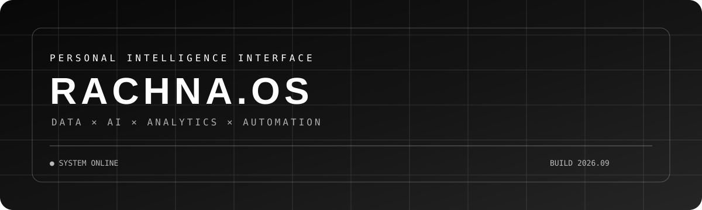
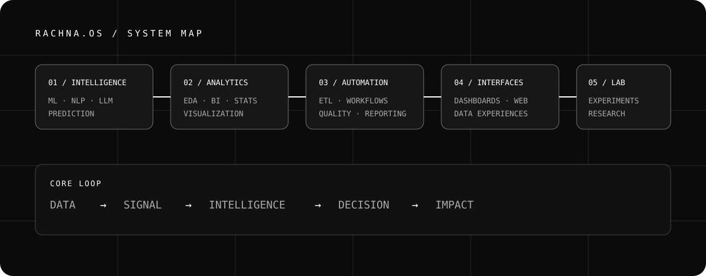
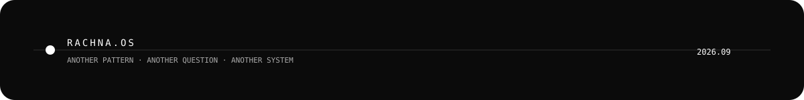

<div align="center">

# RACHNA.OS

### `DATA × AI × ANALYTICS × AUTOMATION`

**I build systems that turn information into intelligence.**

<br/>

<a href="https://rkolahp.github.io/RKola-s-Portfolio/">

</a>
&nbsp;
<a href="https://www.linkedin.com/in/rachnakola">

</a>
&nbsp;
<a href="mailto:rachnakola1107@gmail.com">

</a>

<br/><br/>



</div>

---

<div align="center">

`● SYSTEM ONLINE`    `BUILD 2026.09`    `DFW / USA`

</div>

<br/>

> **DATA IS EVERYWHERE.**
>
> The interesting part is discovering what it means.

---

# `01 // SYSTEM BOOT`

```text
┌────────────────────────────────────────────────────────────────────┐
│                                                                    │
│                         RACHNA.OS                                  │
│                  PERSONAL INTELLIGENCE SYSTEM                      │
│                                                                    │
├────────────────────────────────────────────────────────────────────┤
│                                                                    │
│   INPUT                    TRANSFORM                    OUTPUT      │
│                                                                    │
│   DATA          ───────►   ANALYTICS       ───────►    INSIGHT     │
│   DOCUMENTS     ───────►   AI / ML         ───────►    INTELLIGENCE│
│   QUESTIONS     ───────►   EXPERIMENTS     ───────►    DECISIONS   │
│   WORKFLOWS     ───────►   AUTOMATION      ───────►    IMPACT      │
│                                                                    │
└────────────────────────────────────────────────────────────────────┘
```

I work at the intersection of **data, artificial intelligence, analytics, automation, and human-facing interfaces** — turning messy information into systems people can actually use.

---

# `02 // THE SYSTEM MAP`



```text
/RACHNA.OS
│
├── /INTELLIGENCE
│   ├── Machine Learning
│   ├── Deep Learning
│   ├── NLP
│   ├── LLMs
│   └── Predictive Modeling
│
├── /ANALYTICS
│   ├── Data Exploration
│   ├── Statistical Analysis
│   ├── Business Intelligence
│   ├── Visualization
│   └── Decision Support
│
├── /AUTOMATION
│   ├── ETL
│   ├── Reporting
│   ├── Data Quality
│   └── Intelligent Workflows
│
├── /INTERFACES
│   ├── Dashboards
│   ├── Data Experiences
│   ├── Web Interfaces
│   └── Visual Storytelling
│
└── /EXPERIMENTS
    ├── AI Fraud Detection
    ├── Agentic Resume Intelligence
    ├── Sales Forecasting
    └── Computer Vision Research
```

---

# `03 // THE LAB`

### `EXPERIMENT_001`

## CAN A MACHINE SEE FRAUD?

**AI × NLP × Machine Learning × Document Intelligence**

A fraud-detection system exploring how AI can extract meaningful signals from uploaded documents and support intelligent decision-making.

```text
DOCUMENT
    ↓
TEXT / FEATURES
    ↓
NLP
    ↓
ML / LLM SIGNALS
    ↓
RISK INTELLIGENCE
    ↓
DECISION
```

`AI` `NLP` `PYTHON` `ML` `DOCUMENT ANALYSIS`

---

### `EXPERIMENT_002`

## WHAT IF A RESUME COULD THINK?

**Generative AI × LLM × Agentic Systems × Automation**

An experimental resume-screening concept designed around intelligent extraction, reasoning, matching, and workflow automation.

```text
RESUME
   ↓
EXTRACT
   ↓
UNDERSTAND
   ↓
REASON
   ↓
MATCH
   ↓
RECOMMEND
```

`GENAI` `LLM` `AGENTS` `AUTOMATION` `PYTHON`

---

### `EXPERIMENT_003`

## CAN NUMBERS TELL US WHAT HAPPENS NEXT?

**Data × Forecasting × Visualization × Business Intelligence**

Exploring sales data through cleaning, exploratory analysis, forecasting, and interactive visualization to move from historical numbers toward future decisions.

```text
RAW DATA
   ↓
CLEAN
   ↓
EXPLORE
   ↓
MODEL
   ↓
FORECAST
   ↓
VISUALIZE
```

`PYTHON` `PANDAS` `ML` `TABLEAU` `POWER BI`

---

### `EXPERIMENT_004`

## CAN A SPECIMEN BECOME DATA?

**Research × Computer Vision × Python × Data Extraction**

A research-oriented computer-vision workflow for extracting structured information from herbarium specimen imagery.

```text
SPECIMEN IMAGE
       ↓
       CV
       ↓
BARCODE DETECTION
       ↓
TEXT / IDENTIFIER
       ↓
STRUCTURED DATA
```

`PYTHON` `COMPUTER VISION` `RESEARCH` `DATA`

---

# `04 // TOOLBOX`

<div align="center">

### COMPUTE

`PYTHON` `SQL` `R` `JAVA`

<br/>

### DATA

`PANDAS` `NUMPY` `SCIKIT-LEARN` `SPARK` `HADOOP`

<br/>

### INTELLIGENCE

`TENSORFLOW` `PYTORCH` `NLP` `LLMs` `FEATURE ENGINEERING` `PREDICTIVE MODELING`

<br/>

### VISUALIZATION

`POWER BI` `TABLEAU` `MATPLOTLIB` `DATA STORYTELLING`

<br/>

### CLOUD / DATA PLATFORMS

`AWS` `GCP` `BIGQUERY` `SNOWFLAKE`

<br/>

### SYSTEMS

`ETL` `DATA QUALITY` `AUTOMATION` `BUSINESS INTELLIGENCE` `ANALYTICS ENGINEERING`

</div>

---

# `05 // DATA WEATHER`

```text
╭────────────────────────────────────────────────────────────╮
│                    RACHNA.OS / TELEMETRY                   │
├────────────────────────────────────────────────────────────┤
│                                                            │
│  DATA              ████████████████████░░   HIGH          │
│  AI                █████████████████████░   RISING        │
│  AUTOMATION        ██████████████████░░░░   ACTIVE        │
│  VISUALIZATION     █████████████████░░░░░   ACTIVE        │
│  EXPERIMENTS       ███████████████████░░░   BUILDING      │
│                                                            │
├────────────────────────────────────────────────────────────┤
│                                                            │
│  CURRENT MODE:     EXPLORATION                             │
│  NEXT MODE:        INTELLIGENCE                            │
│                                                            │
╰────────────────────────────────────────────────────────────╯
```

> *Telemetry is intentionally conceptual — the interface is part of the story.*

---

# `06 // CURRENT FREQUENCY`

```text
                         GENERATIVE AI
                               │
                               ▼
                       AGENTIC SYSTEMS
                               │
                               ▼
                    INTELLIGENT WORKFLOWS
                               │
                               ▼
                       DATA INTELLIGENCE
                               │
                               ▼
                     AUTOMATED DECISIONS
```

I'm especially interested in the moment where **data stops being information and starts becoming behavior**.

---

# `07 // THE BUILD LOOP`

```text
                  ┌─────────────┐
                  │   OBSERVE   │
                  └──────┬──────┘
                         ↓
                  ┌─────────────┐
                  │  QUESTION   │
                  └──────┬──────┘
                         ↓
                  ┌─────────────┐
                  │   EXPLORE   │
                  └──────┬──────┘
                         ↓
                  ┌─────────────┐
                  │    BUILD    │
                  └──────┬──────┘
                         ↓
                  ┌─────────────┐
                  │    SHIP     │
                  └──────┬──────┘
                         ↓
                  ┌─────────────┐
                  │    LEARN    │
                  └──────┬──────┘
                         │
                         └──────────────► OBSERVE
```

---

# `08 // SIGNALS`

| SIGNAL       | WHAT IT MEANS                                         |
| ------------ | ----------------------------------------------------- |
| `DATA`       | Find the pattern inside the noise.                    |
| `AI`         | Teach systems to recognize, reason, and predict.      |
| `DESIGN`     | Make complex information understandable.              |
| `AUTOMATION` | Turn repetitive decisions into intelligent workflows. |

---

# `09 // OUTSIDE THE TERMINAL`

My interests extend beyond the traditional boundaries of analytics:

```text
HEALTHCARE
     ×
CYBERSECURITY
     ×
ARTIFICIAL INTELLIGENCE
     ×
RESEARCH
     ×
ROBOTICS
     ×
HUMAN EXPERIENCE
```

The goal isn't simply to build another model.

**The goal is to build something useful.**

---

# `10 // GITHUB TELEMETRY`

<div align="center">

<a href="https://github.com/RKolaHP">


</a>

<a href="https://github.com/RKolaHP">


</a>

<br/><br/>


</div>

---

# `11 // DIGITAL HOME`

<div align="center">

### `PORTFOLIO`

**[RACHNA.KOLA / PORTFOLIO →](https://rkolahp.github.io/RKola-s-Portfolio/)**

<br/>

### `PROFESSIONAL NETWORK`

**[LINKEDIN / RACHNA KOLA →](https://www.linkedin.com/in/rachnakola)**

<br/>

### `SALESFORCE`

**[TRAILBLAZER / RKOLA017 →](https://www.salesforce.com/trailblazer/rkola017)**

<br/>

### `CONTACT`

**[OPEN COMMUNICATION CHANNEL →](mailto:rachnakola1107@gmail.com)**

</div>

---

# `12 // SYSTEM MESSAGE`

<div align="center">

> **There is always another pattern to find.**
>
> **Another question to ask.**
>
> **Another system to build.**

<br/>

```text
RACHNA.OS // BUILD 2026.09
STATUS: ONLINE
MODE: BUILDING
```

<br/>



</div>
